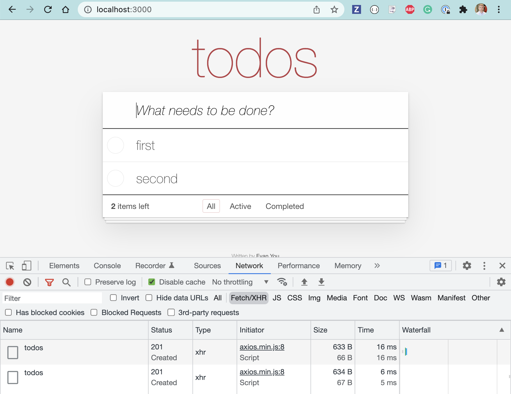

# testing-app-example

> A TodoMVC app with simple REST backend

TodoMVC application based on [TodoMVC Vue example](https://github.com/tastejs/todomvc/tree/gh-pages/examples/vue).



## Install

Requires Node v12+

```
$ npm install
```

Start the application with `npm start` and open `localhost:3000`

## See more

- [Cypress Basics workshop](https://github.com/bahmutov/cypress-workshop-basics)
